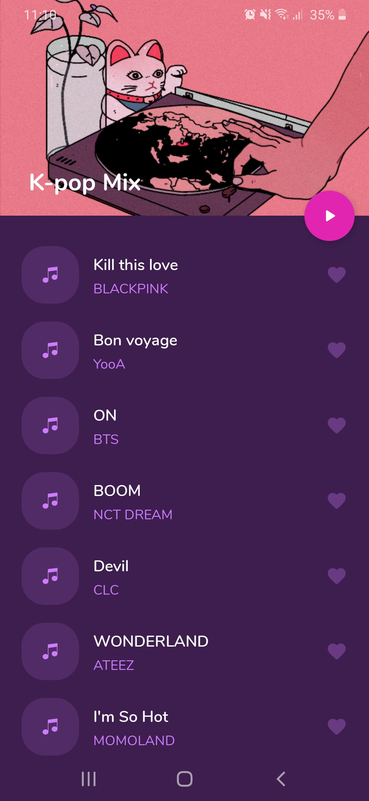
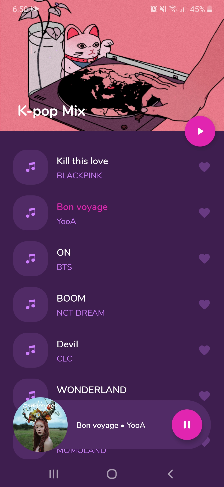
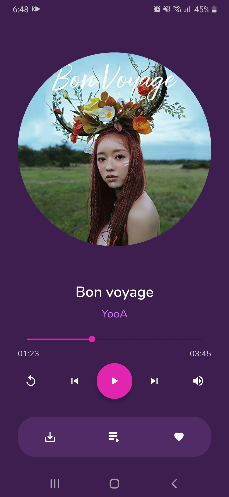
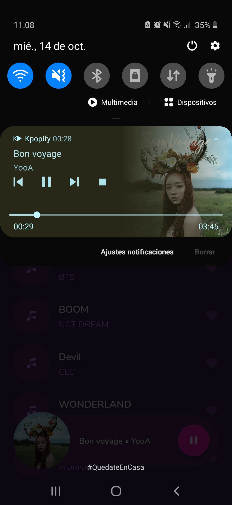

# Kpopify Media App
Android audio playback app.

## Features

- Implements the preferred Android architecture for an audio app (client/server design).
- Retrieves songs metadata from the network.
- Allows background playback using a foreground service.
- Beautiful notification with media style.
- Uses a `MediaBrowserService` to control and expose the current media session.
- Controls the current playback state with actions such as: play/pause, skip to next/previous, shuffle, repeat and stop.
- Supports offline playback using `CacheDataSource` from `ExoPlayer`.

## Libraries used

- Android KTK
- ExoPlayer
- Firebase Firestore
- Glide
- Hilt
- Kotlin coroutines
- Navigation

## Screenshots

|  |  |
|----------|:-------------:|

|  |  |
|----------|:-------------:|
